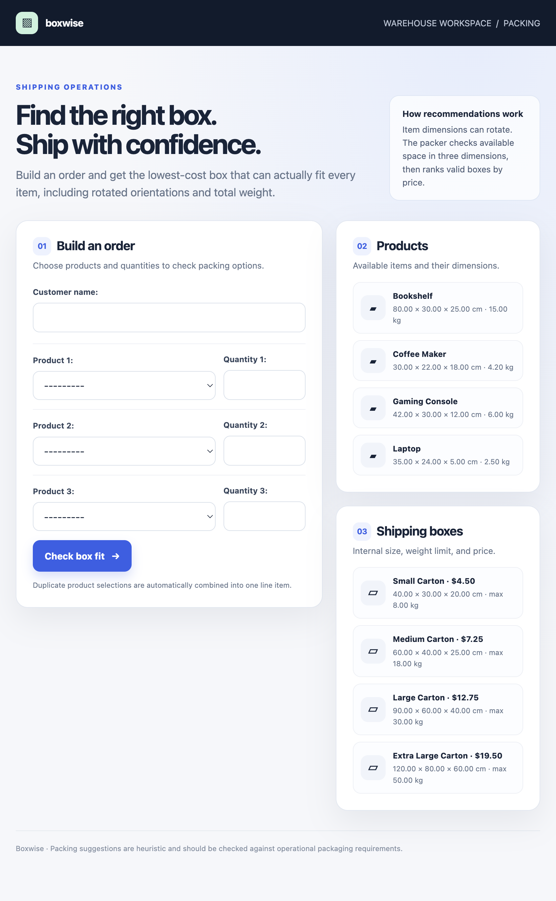
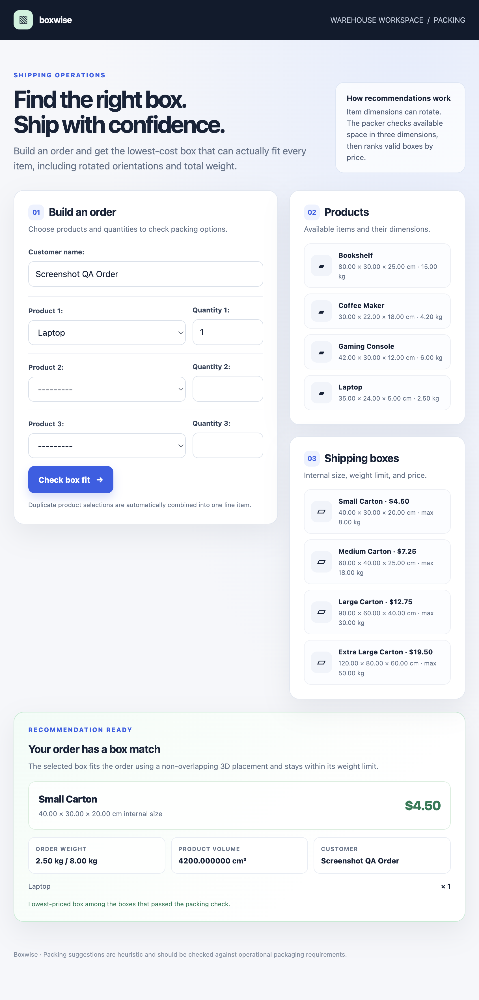
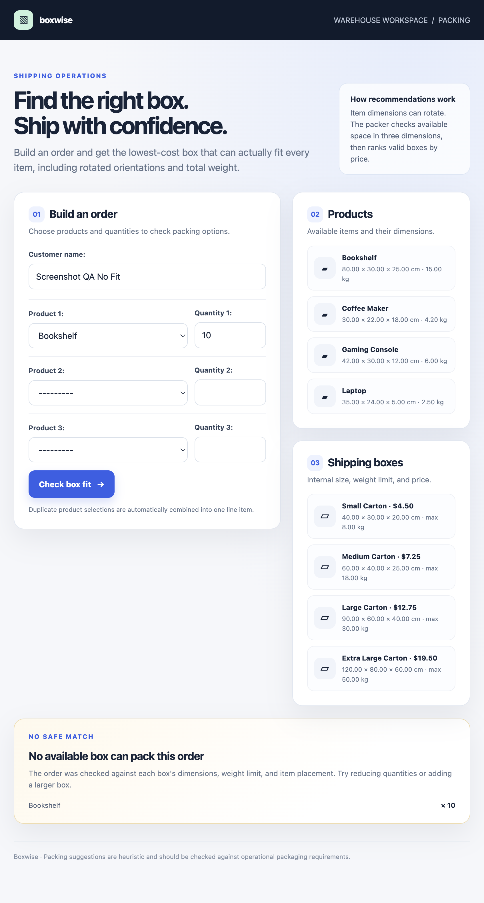

# Test Cases and Output Screenshots

Automated cases are implemented in [`shipping/tests.py`](shipping/tests.py). Run them from the project root:

```bash
python manage.py test shipping --verbosity 2
```

## Automated test cases

| Test | Scenario | Expected result |
| --- | --- | --- |
| `test_product_can_be_rotated_to_fit` | A product's original orientation exceeds a box dimension, but another orientation fits. | The box is feasible. |
| `test_recommends_cheapest_box_that_can_physically_pack_order` | The order is checked against boxes with different dimensions and prices. | An infeasible cheaper box is rejected; the cheapest feasible box is recommended. |
| `test_rejects_order_over_box_weight_limit` | The order weight exceeds a candidate box's maximum. | The box is rejected. |
| `test_rejects_order_that_fails_three_dimensional_packing` | Total volume is below box volume, but the items cannot be placed without overlap. | The box is rejected. |
| `test_repeated_product_selections_are_combined` | The same product is selected in multiple form slots. | One order line is saved with the quantities combined; no uniqueness error occurs. |
| `test_returns_none_when_no_box_can_fit` | No available box can hold the order. | No box is recommended. |
| `test_total_weight_and_volume_are_calculated` | An order contains multiple products and quantities. | Calculated weight and volume match the expected values. |

All seven automated tests passed in the latest run. See [`TEST_OUTPUT.md`](TEST_OUTPUT.md) for the result and test runner output.

## Application screenshots

These screenshots were captured from the running local application separately from the automated test run.

### Order form and catalogue



### Successful recommendation

Example: one Laptop is accepted into the Small Carton for $4.50.



### No feasible box

Example: ten Bookshelves exceed available box limits, so the app reports that no safe match is available.


